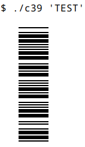

This bash script generates [code39](https://en.wikipedia.org/wiki/Code_39) barcodes as [sixel](https://en.wikipedia.org/wiki/Sixel) images - a sixel capable terminal is required.

(This script is the result of one afternoon's boredom.)
